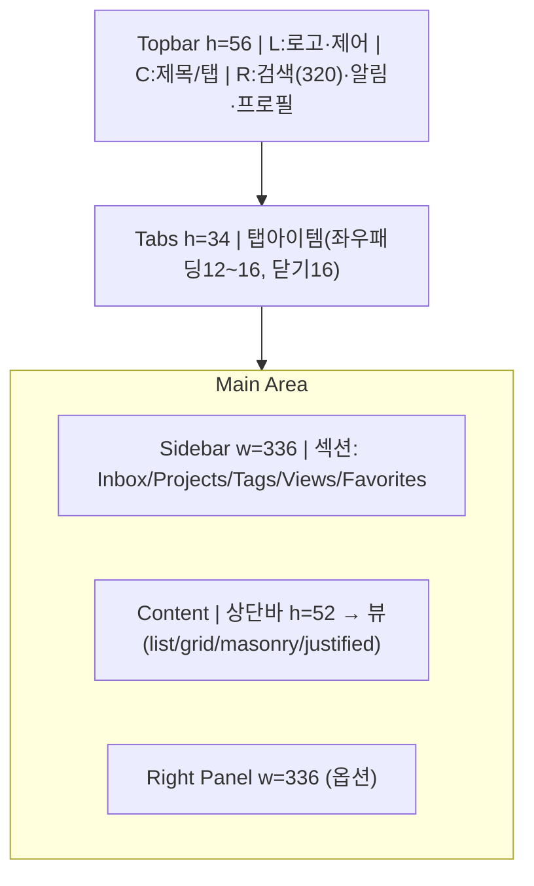
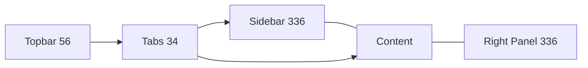
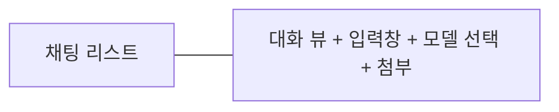
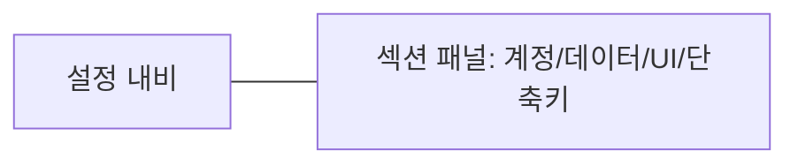
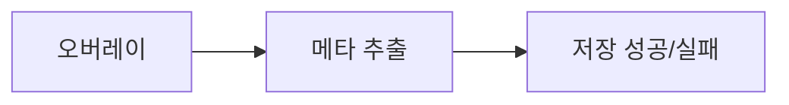
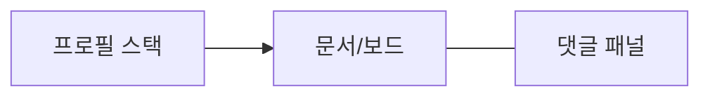
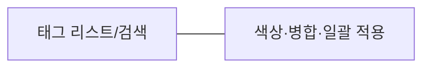
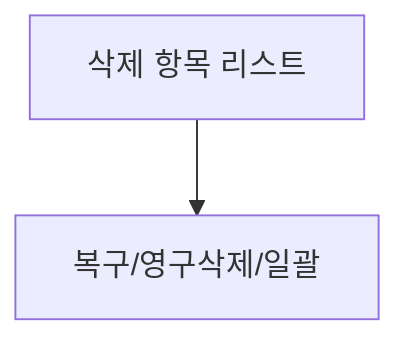
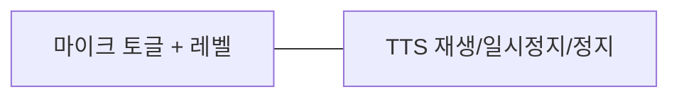
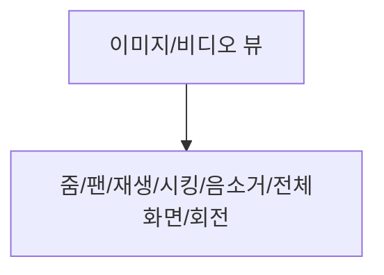

## 개요
- **한줄요약**: 데스크톱 앱(Research/Collection/Notes/AI) 와이어프레임 전 페이지 정의. 레이아웃, 아이콘 위치, 크기, 타이포그라피, 패딩/마진, 상호작용, 상태 규칙을 토큰 기반으로 완전 명세.
- **범위**: App Shell(공통) + 0~17 페이지(Inbox~Media Viewer) + 상태/오프라인/에러 + 편집기/수집/검색/AI + 설정/협업/보이스 + Export.
- **출처**: `design-system/APP_SHELL_QUICK_SPEC.md`, `design-system/tokens-and-shell.json`, `wireframes/WIREFRAME_PAGES_CHECKLIST.md`, `wireframes/UX_STATES_OFFLINE_ERROR.md`, `모음집/8. 요구사항, 기능 정의서.md`, `모음집/7. 추가로 작성중인 프롬프트.md`, `모음집/보일러 플레이트 README.md`, `Tauri_template/SETUP_GUIDE.md`, Notion 요구사항 정의서(읽기 가능 문서 반영), 다른 Notion 링크(로그인 필요로 미반영 항목은 별도 표기), [공개 Notion 프로젝트 개요/트래킹](https://www.notion.so/24d4753fd24b80378ca2ff1dffabddac?p=24d4753fd24b81bf8469e4a2b63ea871&pm=s).

## 용어
- **캔버스**: 앱 렌더 기준 화면. 기본 1680×1050.
- **Shell**: Topbar(56), Tabs(34), Sidebar(336), Splitter(8), Content 영역.
- **토큰**: 모든 색/크기/간격/라운드/아이콘/포커스/섀도우/모션은 `tokens-and-shell.json`만 사용. 임의 px 금지.
- **밀도**: compact=0.9, comfortable=1.0(기본), spacious=1.1.
- **뷰**: list / grid / masonry / justified.
- **카드**: 160×200, r12, gutter 24. 리스트 행높이 52.

---

## 디자인 토큰과 레이아웃 규칙
### Canvas & Grid
- **기본 캔버스**: 1680×1050. 변형: 1440×900, 1280×800.
- **그리드**: 12 컬럼, 거터 24, 좌우 마진 24.
- **Masonry 열수(사이드바 336 기준)**:
  - 1280 → 콘텐츠폭 ≈ 944 → 5열
  - 1440 → 콘텐츠폭 ≈ 1104 → 6열
  - 1680 → 콘텐츠폭 ≈ 1344 → 7열
  - 계산식: floor((콘텐츠폭 + 24) / (카드폭160 + 24))

### Shell(앱 뼈대)
- **Topbar**: 높이 56.
- **Tabs**: 높이 34.
- **Sidebar(좌)**: 폭 336, min 240, max 360, 리사이즈 true.
- **Splitter**: 거터 8, 프리셋: 1/2, 1/3, 1/4.
- **Content**:
  - listRowHeight 52
  - card width 160, height 200, radius 12, gutter 24
  - views: list, grid, masonry, justified
- **Right Panel(우 패널)**: 폭 336(권장), 스냅 24 단위.

### 아이콘/타이포/라운드/섀도우/포커스
- **아이콘**: 기본 24, 보조 20/16, 스트로크 2.
- **라운드**: 입력/버튼/카드 r12, 패널/모달 r20, 칩 r8.
- **타이포**:
  - families: Inter, Pretendard
  - scale: xs 12, sm 14, md 16, lg 20, xl 24, xxl 32, display 40
  - lineHeight: body 1.5, heading 1.4
- **포커스 링**: #5D3587, 2px, offset 2, radius 6.
- **섀도우**: shadow-1=0 1px 2px rgba(0,0,0,.08), shadow-2=0 4px 8px rgba(0,0,0,.12).

### 컬러/모드
- **브랜드**: primary 400:#7B4BA7, 500:#5D3587, 600:#4A2A6D / accent 400:#A06CD5
- **모드**:
  - light: bg #F8F4F0, panel #FFF, panel2 #F3F3F4, text #111216, text2 #6B7280, border #E5E7EB
  - dark:  bg #1C1C1C, panel #2A2B2C, panel2 #343536, text #EDEEF0, text2 #A9AFB8, border #2F323A
  - high-contrast: bg #0B0B0B, panel #121416, panel2 #191C1F, text #FFF, text2 #D1D5DB, border #8B5CF6
- **의미색**: success #10B981, warning #F59E0B, danger #EF4444, info #3B82F6
- **글래스 효과**: blur 22, 배경 알파 0.06, 보더 알파 0.16

### 모션/접근성/레이어
- **모션**: fast 100ms, normal 150ms, slow 200ms; easing standard `cubic-bezier(0.2,0,0,1)`, enter `cubic-bezier(0,0,0.2,1)`, exit `cubic-bezier(0.4,0,1,1)`
- **접근성**: 대비 본문 4.5:1, UI 3:1, 히트 영역 44, reduce motion 지원.
- **ZIndex**: base 0, dropdown 1000, modal 2000, toast 3000, drag 4000. Overlay scrim rgba(0,0,0,0.40).

### 간격 스케일 규칙
- **여백/갭**: 8pt 스케일만 사용(4/8/12/16/24/32/40/48/64). 기본 패딩 24, 카드 내 패딩 16.

---

## App Shell 배치(공통)
- **Topbar(56)**
  - 좌측: 제품명/앱 로고(24), 창 제어(최소/최대/닫기, 플랫폼 규칙)
  - 중앙: 빈 상태 또는 전역 탭/페이지 타이틀
  - 우측: 전역 검색 입력(폭 320, 높이 36, r12), 알림 아이콘(24), 프로필(24)
  - 내부 패딩: 좌우 24, 요소 간 간격 16
- **Tabs(34)**
  - 좌측: 탭 리스트(핀/스크롤), 새 탭 버튼(+, 24)
  - 탭 아이템: 높이 34, 좌우 패딩 12~16, 닫기(× 16) 우측 정렬, 상태 hover/focus/active
- **Sidebar(336)**
  - 섹션: Inbox / Projects / Tags / Views / Favorites
  - 항목 높이 40~44, 섹션 헤더 상단/하단 패딩 12/8, 아이콘 20
  - 리사이즈 핸들 8, 스냅 24 단위
- **Content**
  - 상단 바(필터/정렬/검색): 높이 52, 내부 패딩 16~24
  - 뷰: list(행 52) / grid / masonry / justified
  - 카드: 160×200, r12, gutter 24, 내부 패딩 12~16
- **Right Panel(선택)**
  - 폭 336, 헤더 48~56, 내용 스크롤, 닫기 아이콘 20



---

## 기능 맵(요약)
- 계정: 회원가입/로그인/로그아웃(환경설정에서 로그아웃)
- 레이아웃: 사이드바 접기/펴기/리사이즈, 탭 생성/닫기, 창 분할(1/2,1/3,1/4)
- 환경설정: 프로필/구독/업데이트/기능 옵션/클라우드/메모 설정(가로 여백)
- 메모: 작성/저장/불러오기, 퀵 마크다운, 확대/축소/행·열·글자수 표시, 텍스트 서식(드래그 시 퀵툴), `/` 커맨드, 파일/이미지/링크 삽입, txt/md 스위치
- 스티커: 체크박스/⭐/❌/⚪/▲ 등 시각적 장치, 항상 위, 크기 조절, D&D 수집 연동, 배경 투명도
- 수집: 브라우저 확장(Alt+우클릭·D&D), 메타데이터(제목/URL/파비콘/생성일/AI 요약·태그), 로컬 서버 통신
- 탐색/정리: 콘텐츠 뷰(뷰옵션/정렬), 카테고리 자동 분류, 로컬폴더 추가/새폴더/새파일
- 검색: 키워드 + 의미검색(동의어), 하이라이트, 정렬
- AI: OpenRouter 채팅, 모델 선택, 채팅 생성/목록, 스트리밍/중지, 보이스(TTS/입력)
- 협업: 라이브 커서, 프로필 스택, 댓글, 공유/권한, 채팅, 동기화(Supabase)
- Export: PDF/Markdown, 범위 선택, 파일명 규칙 `{date}_{title}`

> 주: 일부 Notion(로그인 필요) 문서는 내용 접근 불가. 본 명세엔 로컬/공개 문서 및 접근 가능한 Notion의 표 내용을 반영함.

---

## 상태/오프라인/에러(공통)
- Loading: 스켈레톤 우선(스피너 최소), 레이아웃 점프 금지
- Empty: 설명 + 1차 CTA + (선택) 학습 링크
- Success: 중복 피드백 지양
- Offline: 읽기 우선, 쓰기 큐/보류, 상단 오프라인 배지
- Error: 인라인 메시지 + 토스트/모달 기준, 재시도 버튼
- Long Processing: 진행률/단계 + 취소 가능 시 버튼
- 글로벌: 네트워크 배지(Topbar), 에러 바운더리(복구), 토스트(우상단, 3~5초, aria-live="polite"), 재시도(1s/2s/4s), ESC 오버레이 닫기, 포커스 링, 히트 영역 44
- DnD: 드롭 가시화, 실패 원복 + 토스트, 키보드 대체 경로
- 검색(오프라인): 의미검색 비활성, 키워드만 허용, 쿼리/필터/정렬 유지

체크리스트(임베드)
- [ ] 스켈레톤/빈/에러 3상태 설계, 오프라인 인디케이터
- [ ] 인라인 에러 + 토스트/모달 기준, 재시도(백오프)
- [ ] 키보드/포커스/히트44, DnD 피드백/원복
- [ ] aria-live, 포커스 트랩, ESC 닫기

---

## 페이지별 와이어프레임(0~17)
문법: 공통 Shell + 페이지 특화 요소만 기재. 사이즈는 토큰/8pt 스케일로 정의. 타이포 기본 md(16), 섹션 헤더 lg(20), 타이틀 xl(24)~xxl(32), 디스플레이 40.

### 0) App Shell 공통 (M0)
- 레이아웃: Topbar(56) / Tabs(34) / Sidebar(336) / Splitter(8) / Content / (옵션) Right Panel(336)
- 상단 전역: 글로벌 검색(폭 320), 알림(24), 프로필(24), 창 제어 버튼
- 단축키: /, Ctrl/Cmd+K, Tab 순환, 사이드바 토글
- 상태: hover/focus/active/disabled/dragOver/selected



### 1) Inbox(수집함) (M0)
- 상단: 검색창(폭 320), 정렬(최신/오래됨), 필터(타입/태그)
- 뷰: List/Grid/Masonry/Justified, 카드 160×200 gutter 24
- 메타: 제목, sourceUrl, favicon(16), createdAt, aiSummary/keywords
- 좌: 폴더 트리(드래그 이동), 멀티 선택(Shift/Ctrl), 벌크 액션, 컨텍스트 메뉴, 스켈레톤/빈 상태
- 페이지네이션 vs 인피니트 스크롤: 옵션(초기 인피니트 권장)

```mermaid
flowchart TB
  header[정렬·필터·검색 h=52]
  list[카드 160x200 gutter24 | List/Grid/Masonry/Justified]
  header --> list
```

### 2) 프로젝트(폴더) 뷰 (M0)
- 헤더: 이름, 색/아이콘(24), 공유 상태
- 우 콘텐츠: 정렬/필터 + 보기모드 스위치(list/grid)
- 빈 상태: 가이드 + CTA
- 멀티 선택/벌크 태깅/이동

```mermaid
flowchart TB
  ph[프로젝트 헤더: 이름·색·공유]
  toolbar[보기모드 스위치 + 정렬/필터]
  grid[콘텐츠 영역(list/grid)]
  ph --> toolbar --> grid
```

### 3) 아이템 상세(우패널/모달) (M0)
- 우패널 336 또는 모달 r20
- 탭: 미디어(이미지/링크/텍스트), 메타(제목/URL/생성일/태그/AI 요약/키워드)
- 액션: 즐겨찾기, 이동, 삭제, 복사, 원본 열기
- 편집 가능: 제목/태그/노트(자동 저장)

```mermaid
flowchart LR
  list[목록/그리드] --- panel[우패널 w=336 | 미디어·메타·액션]
```

### 4) 메모 에디터 (M0)
- 에디터: Monaco Editor, 제목 입력, 툴바(볼드/이탤릭/밑줄/코드/체크리스트)
- `/` 커맨드: 이미지/카드/구분선/콜아웃, 제목 h1~h3, 토글, 할 일, 코드, 불릿, 인덱스, 구분선(자동 변환)
- 서식: 드래그 시 퀵툴(폰트/굵기/스타일/색/배경색), 확대/축소, 행/열/글자수, 저장/불러오기, md/txt 전환
- 임베드 Pill: 텍스트/이미지/링크 드래그 시 pill 형태(파비콘 16 + 도메인 + 제목). 텍스트 생략 없음, 길이에 따라 폰트 동적 축소.

```mermaid
flowchart TB
  title[제목 입력]
  toolbar[툴바 | B I U S Code Checklist /]
  editor[Monaco Editor | Pill 임베드 지원]
  title --> toolbar --> editor
```

### 5) 검색 (M0)
- 검색창: 추천/히스토리, 디바운스, 의미검색 토글
- 결과 카드: 제목/스니펫/타입/점수, 필터(타입/폴더/날짜), 정렬(점수/최신), 하이라이트 처리

```mermaid
flowchart TB
  q[검색 입력 + 의미검색 토글]
  fac[필터(타입/폴더/날짜) + 정렬]
  res[결과 리스트(카드)]
  q --> fac --> res
```

### 6) AI 어시스턴트 (M1)
- 좌: 채팅 리스트(최근 대화)
- 우: 대화 뷰(버블, 코드/이미지 렌더), 하단: 입력 + 전송 + 모델 선택 + 첨부, 스트리밍 표시/중지/토큰 경고



### 7) 스티커 메모 (M1)
- 독립 창, 맨앞 고정 토글, 간단 편집, 창 크기/고정 토글(타이틀바)
- 편집 툴: 텍스트/체크박스/이모지, D&D 수집 연동, 시각 장치 ✅ ⭐ ❌ ⚪ ▲

```mermaid
flowchart TB
  win[스티커 창 | always-on-top]
  tools[텍스트·체크박스·이모지]
  body[간단 에디트 + D&D]
  win --> tools --> body
```

### 8) 설정 (M0)
- 섹션: 계정(로그인/프로필), 데이터(백업/복원/클라우드-Supabase), UI(테마/밀도/투명도), 단축키 매핑, 로그아웃



### 9) 탭/분할 레이아웃 매니저 (M0)
- 탭: 새 탭(+), 고정, 스크롤, 순서 변경(드래그)
- 분할: 프리셋(1/2,1/3,1/4), 리사이즈 핸들, 최소 폭/높이, 스냅

```mermaid
flowchart TB
  tabs[탭 바 | 신규/고정/스크롤]
  splits[분할 프리셋 버튼 + 리사이즈 핸들]
  canvas[분할 캔버스]
  tabs --> splits --> canvas
```

### 10) 수집 플로우 (M0)
- Alt+우클릭 오버레이 → 메타 추출 → 저장 성공/실패(토스트). 확장 ↔ 앱 통신 상태 표시
- 드롭존 가시성, 실패 시 원복 + 재시도 가이드



### 11) 협업/공유 (M2)
- 상단 프로필 아바타 스택, 라이브 커서(색/이니셜), 댓글 패널/인라인 코멘트, 퀵 채팅 '/', 공유/권한(읽기/편집)



### 12) 내보내기/공유 (M1)
- 범위 선택(페이지/선택/전체), 스타일 옵션(이미지 포함/캡션), 파일명 `{date}_{title}`

```mermaid
flowchart TB
  range[범위 선택]
  style[스타일 옵션]
  export[PDF/Markdown Export]
  range --> style --> export
```

### 13) 태그/분류 매니저 (M1)
- 태그 리스트/검색, 색상 선택, 병합, 일괄 태그 적용(선택 아이템)



### 14) 트래시/복구 (M1)
- 목록(삭제일, 남은일수), 복구/영구삭제, 일괄 처리



### 15) 온보딩/로그인 (M0)
- 로그인/회원가입/비밀번호 재설정, 최초 실행: 테마·밀도·투명도 설정

```mermaid
flowchart TB
  auth[로그인/회원가입/재설정]
  first[최초 설정(테마·밀도·투명도)]
  auth --> first
```

### 16) 보이스 (M2)
- 마이크 on/off(레벨), 읽어주기(TTS) 재생/일시정지/정지, 입력 전송



### 17) 미디어 뷰어 (M1)
- 이미지 줌/팬, 비디오 재생/시킹/음소거, 전체화면/회전



---

## 상세 UI 스펙(공통 수치)
- 패딩/마진: 레이아웃 컨테이너 좌우 24, 섹션 간 24~32, 컨트롤 간 12~16
- 입력: 높이 36~40, r12, 내부 패딩 12x16, 포커스 링 2
- 버튼: 높이 36, 좌우 12~16, r12, 아이콘 20~24, 간격 8
- 카드: 외곽 r12, 내부 패딩 12~16, 섀도우-1, hover 배경 `interaction.state.neutral.hover`
- 모달/패널: r20, 섀도우-2, 헤더 48~56, 바디 스크롤, 닫기 20
- 리스트 행: 높이 52, 좌측 아이콘 20, 텍스트 md(16)
- 아이콘 배치: 동일 라인 내 간격 8~12, 그룹 간 16
- 히트 영역: 최소 44×44 보장

## 편집기 스펙(메모/스티커)
- Monaco Editor: md/txt 스위치, 자동 저장, 버전 히스토리, Undo/Redo, 확대/축소
- 서식 퀵툴: 텍스트 드래그 시 표시(B/I/U/S/Code/Color/BG)
- `/` 커맨드 팔레트: 텍스트, 제목(h1~h3), 토글, 할 일, 코드, 불릿, 인덱스, 구분선, 이미지/카드/구분선/콜아웃 삽입
- 링크 Pill: `[제목](링크)` + 파비콘 16 + 도메인 + 제목. 에디터 내 렌더는 pill, 내보내기(md/txt) 시 텍스트 대체전략 별도(하단 참고)

## 수집 스펙(확장/오버레이)
- 단축키: Alt+우클릭(기본), D&D 지원. 오버레이 단계: 캡처 → 메타 추출 → 저장
- 메타: 제목/URL/파비콘(16)/생성일 + AI 요약/키워드
- 실패 시: 인라인 가이드 + 재시도, 토스트, 원복

## 검색 스펙
- 입력: 디바운스 150ms, 추천/히스토리, 의미검색 토글
- 결과: 카드 리스트, 하이라이트, 필터(타입/폴더/날짜), 정렬(점수/최신)
- 오프라인: 키워드만 허용(로컬 인덱스), 의미검색 비활성 처리

## 협업/동기화
- 프로필 스택, 라이브 커서(색/이니셜), 인라인 댓글, 권한(읽기/편집)
- 동기화/백업: Supabase(옵션), 충돌 전략: 타임스탬프 우선 + 수동 병합

## Export 정책
- 형식: PDF/Markdown
- 범위: 페이지/선택/전체, 스타일(이미지 포함/캡션)
- 파일명: `{YYYY-MM-DD}_{title}`
- Pill 내보내기: md/txt에서는 `[제목](링크)` + `favicon:URL` 메타 블록(문서 하단) 또는 대괄호 확장 태그로 선택지 제공

---

## 기술/프로젝트 구조 참고(구현 가이드)
- 스택(보일러플레이트): Electron + Vite + React + TS + React Router v7 + Tailwind v4 + shadcn/ui + Supabase + Drizzle
- 폴더: `src/components/ui`, `src/features/*`, `src/db/schema.ts`, `src/lib/*`, `src/routes/*`, `src/main.ts`, `src/preload.ts`, `src/renderer.tsx`
- 핵심 규칙: Feature → Page → Router 조립. 다중 패널 레이아웃은 Page에서 Feature 조합.
- DB: Drizzle `db`(CRUD), Supabase `supabase`(Auth/Storage). 마이그레이션 `drizzle-kit push`.
- WSL2: GPU 가속 비활성 `app.disableHardwareAcceleration()` 권장.
- Tailwind: `@tailwindcss/vite`, index.css에 `@import "tailwindcss"`.
- shadcn/ui: 임시 vite.config.ts 생성 후 init/add, 완료 후 삭제.

> 주: 제품 계획 상 Foundation은 Tauri 기반 목표가 포함되어 있으나, 현재 제공된 템플릿은 Electron 기반. 런타임 선택 사항은 프로젝트 단계별 결정 필요.

---

## 오픈 이슈(와이어프레임 제작 전 확정 필요)
1) Pill 내보내기 표현: md/txt 호환을 위해 메타 블록 vs 커스텀 태그 중 선택(파비콘/도메인/제목 유지 여부)
2) 메모 에디터 Liquid Glass: Monaco 투명/블러 스타일 적용 범위와 성능 기준(WSL2 포함)
3) 검색 엔진: 의미검색 구현(Elasticsearch-rs?)과 로컬 인덱싱 범위/용량/성능 기준
4) 탭/스플릿 상태 저장: 레이아웃 프리셋/복원 정책
5) 우패널 폭: 기본 336 유지 vs 상황별 확장(360/384) 스냅 규칙
6) 페이지네이션 vs 인피니트: Inbox 기본 전략과 전환 조건
7) 협업 실시간 프로토콜: 충돌해결/커서/댓글 동기화 상세
8) Tauri vs Electron 최종 채택 및 빌드 타겟(OS별 타이틀바/제어 상이)

---

## 와이어프레임 제작 체크리스트(실행)
- [ ] 캔버스 1680/1440/1280 변형별 아트보드 생성
- [ ] 공통 Shell 배치(Topbar/Tabs/Sidebar/Splitter/Content/RightPanel)
- [ ] Masonry 5/6/7 열 프리셋 적용(카드 160, gutter 24)
- [ ] 각 페이지(0~17) 상단 툴바/필터/검색 높이 52, 패딩 16~24
- [ ] 아이콘 24(보조 20/16), 간격 8~12, 그룹 간 16
- [ ] 포커스 링/섀도우/라운드/히트44 반영
- [ ] 상태 3종(스켈/빈/에러) + 오프라인 배지 삽입
- [ ] 다크/라이트/하이콘 대비 검증(본문 4.5:1, UI 3:1)

---

## 부록: 토큰 요약
- spacing: [4,8,12,16,24,32,40,48,64]
- radius: sm4, md8, lg12, xl16; panel/modal r20; chip r8
- typography: xs12, sm14, md16, lg20, xl24, xxl32, display40; lh body1.5, heading1.4
- icon: [16,20,24], stroke 2
- focusRing: color #5D3587, width 2, offset 2, radius 6
- motion: 100/150/200ms; standard/enter/exit
- zIndex: base0, dropdown1000, modal2000, toast3000, drag4000
- content: listRowHeight52, card 160×200 r12 gutter24
- color modes: light/dark/high-contrast; brand primary 400/500/600; accent 400
- density: compact 0.9 / comfortable 1.0 / spacious 1.1
- breakpoints: base 1280, large 1440

---

## 철학(제품 원칙)
- 사용자 경험 최우선, 직관적 UI, 학습 곡선 최소화
- 작업 흐름(웹서핑) 방해하지 않기, 뇌/손 에너지 절약, 시간 절약

